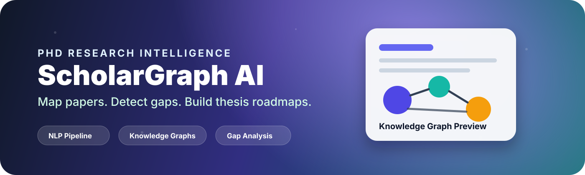
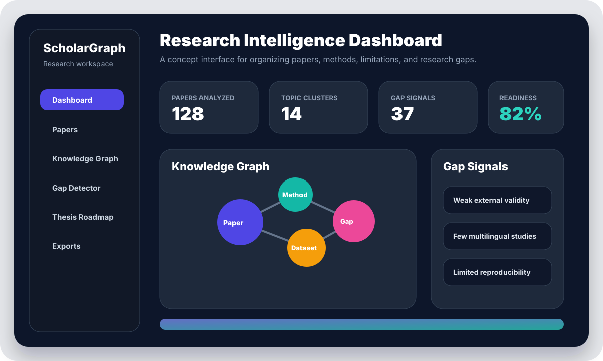
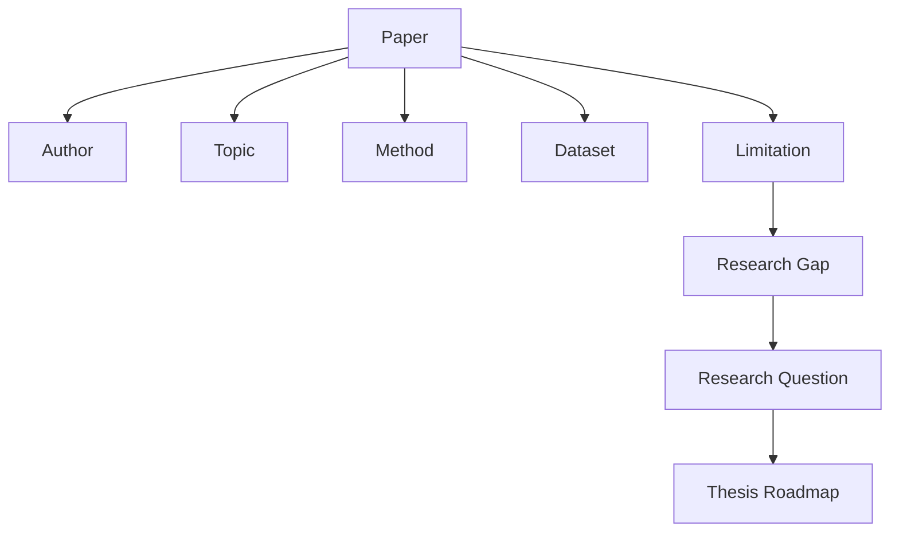
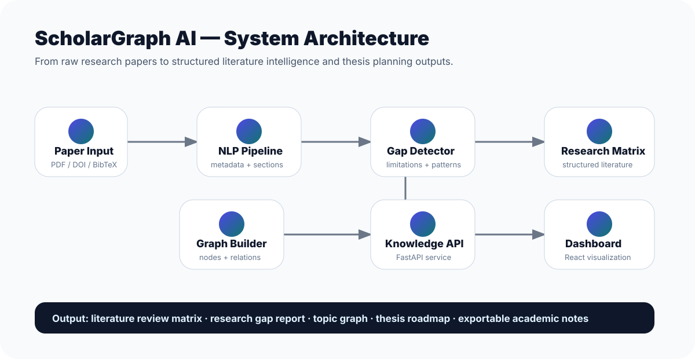
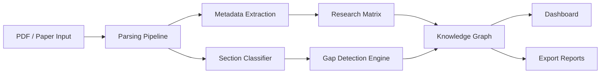

<p align="center">
  
</p>

<h1 align="center">ScholarGraph AI</h1>

<p align="center">
  <b>A PhD-level research intelligence platform for literature discovery, knowledge-graph construction, gap analysis, and thesis planning.</b>
</p>

<p align="center">
  
  
  
  
  
</p>

---

## Overview

**ScholarGraph AI** is a research-oriented software project designed for PhD students, supervisors, and research labs that need to understand large bodies of academic literature. Instead of treating papers as isolated PDFs, ScholarGraph AI models research as a connected system of **papers, authors, methods, datasets, theories, keywords, claims, limitations, and open problems**.

The platform is designed to help scholars answer questions such as:

- What are the dominant themes in this research area?
- Which methods and datasets are used most often?
- Which problems have been solved, partially solved, or ignored?
- What limitations keep appearing across multiple papers?
- Which research gaps are realistic for a PhD thesis?
- How can a literature review be organized into a defensible academic argument?

<p align="center">
  
</p>

---

## Why this project matters

PhD research begins with an overwhelming literature landscape. Students often collect dozens or hundreds of papers, but struggle to convert them into a structured understanding of the field. ScholarGraph AI addresses this problem by combining:

- **Natural Language Processing** for extracting metadata, methods, findings, and limitations.
- **Knowledge Graphs** for mapping relationships between papers, authors, topics, methods, and research gaps.
- **Research Analytics** for comparing contributions, methodologies, datasets, and evaluation metrics.
- **Academic Planning Tools** for generating literature matrices, research questions, and thesis roadmaps.

The goal is not to replace scholarly judgment. The goal is to support researchers with transparent, organized, and explainable research intelligence.

---

## Core Features

### 1. Research Paper Ingestion

Upload or register academic papers and extract structured metadata.

Planned extraction fields include:

| Category | Examples |
|---|---|
| Bibliographic metadata | title, authors, year, venue, DOI |
| Research context | domain, keywords, problem statement |
| Methodology | model, algorithm, framework, experiment design |
| Data and evidence | datasets, sample size, benchmark, evaluation metrics |
| Contribution | novelty, main finding, claimed improvement |
| Limitations | weaknesses, threats to validity, future work |
| Research gap signals | unresolved issues, contradictory findings, missing evaluations |

### 2. Literature Review Matrix

ScholarGraph AI converts papers into a structured literature matrix suitable for thesis and dissertation work.

| Paper | Problem | Method | Dataset | Key Finding | Limitation | Possible Gap |
|---|---|---|---|---|---|---|
| Paper A | Detect misinformation | Transformer classifier | Social media posts | Improved F1-score | Limited multilingual evaluation | Cross-lingual robustness |
| Paper B | Explain model outputs | Attention analysis | Benchmark corpus | Better interpretability | Small user study | Human-centered validation |

### 3. Research Knowledge Graph

The system models academic knowledge as a graph:



### 4. Gap Detection Engine

The gap detector is designed to identify patterns such as:

- Repeated limitations across papers.
- Underexplored populations, languages, regions, or datasets.
- Weak evaluation design or missing baselines.
- Contradictory findings between studies.
- Overdependence on one methodology.
- Lack of reproducibility, external validity, or interpretability.

### 5. Thesis Roadmap Generator

The roadmap module turns research gaps into a structured PhD plan:

1. Research theme selection.
2. Literature cluster analysis.
3. Gap justification.
4. Research question formulation.
5. Methodology planning.
6. Dataset or experiment design.
7. Evaluation strategy.
8. Publication plan.
9. Dissertation chapter outline.

---

## System Architecture

<p align="center">
  
</p>



---

## Proposed Tech Stack

| Layer | Technology | Purpose |
|---|---|---|
| Frontend | React + Vite | Interactive research dashboard |
| Styling | Tailwind CSS | Modern academic UI |
| Backend | FastAPI | REST API for analysis services |
| NLP | Python, spaCy-ready architecture | Text processing and entity extraction |
| Graph | NetworkX-ready architecture | Relationship modeling and graph analytics |
| Storage | SQLite for prototype | Lightweight local persistence |
| Visualization | SVG, Mermaid, future D3/React Flow | Research graph views |
| Documentation | Markdown | Academic and developer documentation |

---

## Repository Structure

```text
ScholarGraph-AI/
├── README.md
├── LICENSE
├── .gitignore
├── assets/
│   ├── banner.svg
│   ├── demo-dashboard.svg
│   └── system-architecture.svg
├── backend/
│   ├── README.md
│   ├── requirements.txt
│   └── app/
│       ├── main.py
│       ├── models.py
│       └── services/
│           ├── gap_detector.py
│           ├── graph_builder.py
│           └── paper_parser.py
├── frontend/
│   ├── README.md
│   ├── package.json
│   ├── index.html
│   └── src/
│       ├── App.jsx
│       ├── main.jsx
│       └── styles.css
└── docs/
    ├── architecture.md
    ├── research-methodology.md
    └── roadmap.md
```

---

## Quick Start

### 1. Clone the repository

```bash
git clone https://github.com/Hirakhyzer/ScholarGraph-AI.git
cd ScholarGraph-AI
```

### 2. Run the backend

```bash
cd backend
python -m venv .venv
source .venv/bin/activate  # Windows: .venv\Scripts\activate
pip install -r requirements.txt
uvicorn app.main:app --reload
```

Backend API will run at:

```text
http://localhost:8000
```

### 3. Run the frontend

```bash
cd frontend
npm install
npm run dev
```

Frontend will run at:

```text
http://localhost:5173
```

---

## Example API Usage

```bash
curl -X POST http://localhost:8000/analyze/paper \
  -H "Content-Type: application/json" \
  -d '{
    "title": "Explainable AI for Academic Literature Review",
    "abstract": "This study explores explainable AI methods for literature review automation...",
    "keywords": ["explainable AI", "literature review", "knowledge graph"]
  }'
```

Example response:

```json
{
  "paper_id": "paper_001",
  "themes": ["explainable AI", "literature review automation", "knowledge graph"],
  "possible_gaps": [
    "Need for human-centered validation",
    "Limited benchmark datasets for literature review quality",
    "Lack of transparent evaluation protocols"
  ],
  "recommended_research_questions": [
    "How can knowledge graphs improve transparency in AI-assisted literature review?"
  ]
}
```

---

## Academic Use Cases

### For PhD Students

- Build a literature review matrix.
- Track papers by theme, method, and limitation.
- Identify defensible research gaps.
- Create a thesis roadmap.
- Prepare supervision meeting notes.

### For Supervisors

- Review student reading progress.
- Compare research directions.
- Evaluate novelty claims.
- Discuss methodological weaknesses.

### For Research Labs

- Maintain a shared research map.
- Track publication clusters.
- Identify collaboration opportunities.
- Build project-specific knowledge bases.

---

## Research Design Philosophy

ScholarGraph AI follows four principles:

1. **Transparency** — every extracted gap should be traceable to paper-level evidence.
2. **Scholar control** — AI suggestions should support, not replace, researcher judgment.
3. **Reproducibility** — structured outputs should be exportable and auditable.
4. **Academic rigor** — outputs should align with literature review, methodology, and thesis-writing standards.

---

## Roadmap

### Phase 1 — Research Prototype

- [x] Repository structure
- [x] Academic README
- [x] Backend API scaffold
- [x] Frontend dashboard mockup
- [x] Architecture documentation

### Phase 2 — Paper Intelligence

- [ ] PDF text extraction
- [ ] Metadata parsing
- [ ] Abstract summarization
- [ ] Method and dataset extraction
- [ ] Limitation extraction

### Phase 3 — Graph Intelligence

- [ ] Paper-topic graph
- [ ] Author-paper network
- [ ] Method-dataset relationship graph
- [ ] Research gap clustering
- [ ] Graph centrality metrics

### Phase 4 — PhD Workflow Tools

- [ ] Literature review matrix export
- [ ] Research question generator
- [ ] Thesis roadmap builder
- [ ] Supervisor meeting report
- [ ] Markdown and PDF exports

### Phase 5 — Advanced Research AI

- [ ] Multi-paper contradiction detection
- [ ] Citation context analysis
- [ ] Novelty estimation
- [ ] Research trend timeline
- [ ] Explainable recommendation engine

---

## Screenshots and Visual Previews

This repository currently includes SVG-based concept previews under the `assets/` directory. They are designed to make the repository attractive while the functional prototype evolves.

| Preview | Purpose |
|---|---|
| `banner.svg` | Professional GitHub repository hero banner |
| `demo-dashboard.svg` | Dashboard concept preview |
| `system-architecture.svg` | Technical architecture diagram |

---

## Ethical and Academic Integrity Statement

ScholarGraph AI is designed as a research support tool. It should not be used to fabricate citations, misrepresent sources, or replace original scholarly work. All AI-generated suggestions must be verified against the original papers before being used in a thesis, dissertation, article, or grant proposal.

---

## Contributing

Contributions are welcome. Useful contributions include:

- Improving paper parsing accuracy.
- Adding graph visualization modules.
- Creating better literature matrix templates.
- Adding tests and evaluation benchmarks.
- Improving documentation for PhD research workflows.

Please open an issue before major changes so the direction can be discussed clearly.

---

## License

This project is released under the MIT License.

---

## Author

Created by **Hira Khyzer** as a research-focused, PhD-level academic software project.

<p align="center">
  <b>ScholarGraph AI — turn scattered papers into structured research intelligence.</b>
</p>
