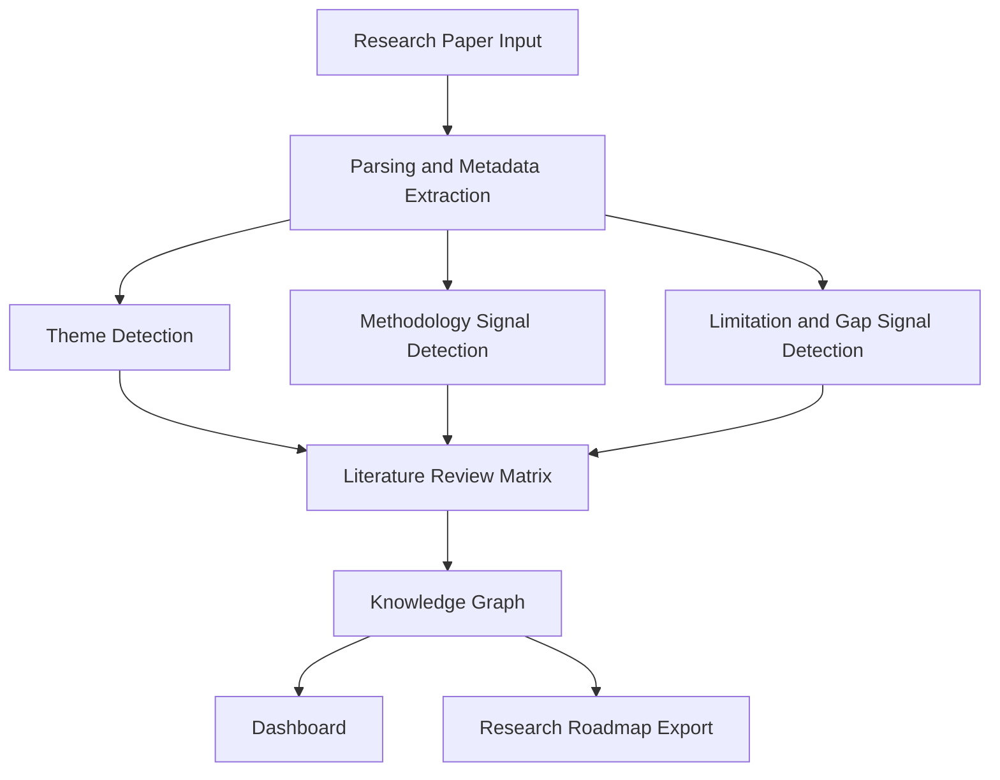
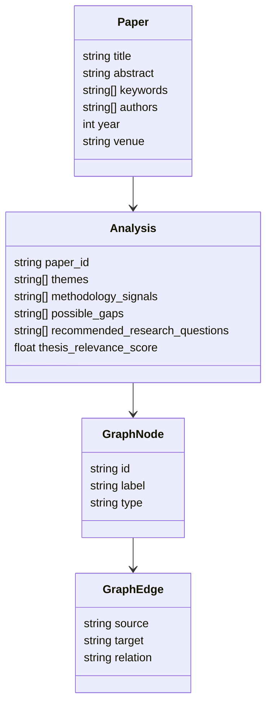

# Architecture

ScholarGraph AI is organized as a modular research-intelligence system. The current repository is a runnable prototype scaffold with clear boundaries between frontend, backend, NLP services, graph services, and academic documentation.

## High-level flow

## Main modules

### Frontend

The frontend is a React/Vite dashboard that presents the research workflow visually. It is designed to later connect directly to the backend endpoints.

Important responsibilities:

- Render academic dashboard UI.
- Show literature review matrix.
- Display graph visualizations.
- Trigger paper analysis calls.
- Export structured research outputs.

### Backend

The backend is a FastAPI service. It currently exposes simple, deterministic endpoints that can be extended with more advanced NLP models.

Important responsibilities:

- Accept paper metadata and abstract inputs.
- Extract theme candidates.
- Identify methodology signals.
- Detect research gap indicators.
- Return knowledge graph and literature matrix structures.

### NLP and research intelligence layer

The current prototype uses transparent keyword and pattern-based logic. This is intentional because it allows the system to run locally without API keys. Future versions can add:

- PDF section extraction.
- Named entity recognition.
- Citation context parsing.
- Embedding-based clustering.
- LLM-assisted summarization with source-grounded verification.

### Graph layer

The graph layer models scholarly knowledge as nodes and edges.

Example node types:

- Paper
- Author
- Topic
- Method
- Dataset
- Limitation
- Research Gap
- Research Question

Example edge types:

- `uses_method`
- `evaluates_on`
- `has_limitation`
- `suggests_gap`
- `motivates_question`

## Data model

## Future architecture upgrades

1. Add persistent storage with PostgreSQL.
2. Add vector search with pgvector, Chroma, or FAISS.
3. Add graph database support with Neo4j or ArangoDB.
4. Add task queue for large PDF processing.
5. Add reproducible evaluation benchmarks.
6. Add user workspaces for students, supervisors, and labs.
